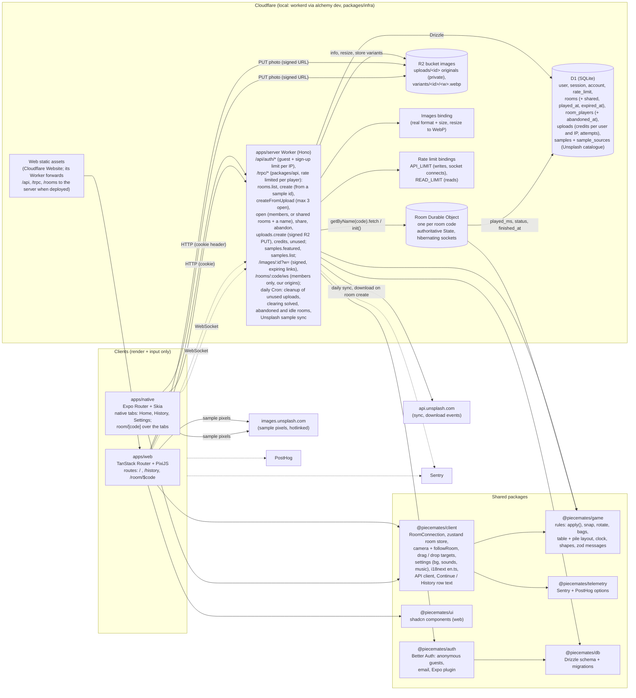

# Architecture

How Piecemates fits together, for planning and for picking the project back up. Rules for contributors are in `AGENTS.md`; plans are in `ROADMAP.md`.

## The whole project



- **Who decides:** the Room Durable Object runs `apply()` from `@piecemates/game` on every message and broadcasts what it accepted. Clients run the same `apply()` on the echo, so everyone's state stays identical. Only the dropped piece's position travels.
- **What is stored where:** live piece state lives in the Durable Object's storage (one `state` key per room). D1 only indexes rooms: who owns them, who played (and who abandoned), the seed and grid, play time and whether it's solved (for Continue and History).
- **The server only touches pixels for uploads:** piece shapes come from `(seed, rows, cols)`, so every client cuts the same puzzle from the image URL. An uploaded photo goes from the device straight to R2; the Worker checks its real format and size, then serves WebP at the width asked for (steps of 256, up to 3072), made once and kept in R2. Photo links are signed and expire after one to two weeks; list and open sign them again.
- **Limits:** guests and email sign-ups per IP (Better Auth, `rate_limit` table), API writes and reads per player (rate limit bindings), upload credits per player and per IP over 24h (`uploads` table), 3 open rooms, 4 players, 20 room messages a second per player, 20 bags. Caps are checked inside the insert, so parallel requests can't pass them.
- **Stale rooms:** the daily Cron clears a room once it's solved, every player abandoned it, or nobody played it for 30 days (`played_at`, set when the room empties or is solved). It deletes the Durable Object's storage and the uploaded original, and sets `expired_at`; the D1 rows stay for History, a cleared room leaves Continue, and `rooms.open` answers `roomExpired`.
- **Samples:** the daily Cron fills a D1 catalogue from Unsplash topics and searches (200 photos, then 5 per category a day) and marks a few featured. Photos always load from Unsplash's CDN, as its API terms require; we store only the link, size, colour and credit. A room from a sample makes the Worker send Unsplash a download event, and the new room sheet credits the photographer.
- **Per device, never sent:** the camera, which bag I'm looking at, my tidy positions, and my settings (table colour, sounds, haptics, music).

## A room's life

```mermaid
sequenceDiagram
  autonumber
  actor P as Player (web or iOS)
  participant C as @piecemates/client
  participant W as Worker (Hono)
  participant A as Better Auth
  participant D1 as D1
  participant R as Room DO
  participant R2 as R2
  participant U as Unsplash API

  P->>C: open the app
  C->>A: getSession, else sign in anonymously
  A->>D1: user + session rows
  P->>C: Home
  C->>W: rooms.list {open} (Continue, cached, refetched after a mutation or opening a room)
  C->>W: samples.featured, samples.list {category}
  P->>C: pick a sample or a photo, piece count, rotated pieces (sheet)
  opt a photo
    C->>W: uploads.create {type, size}
    W->>D1: check credits (user and IP), insert uploads row
    W-->>C: {id, putUrl} (5 min, type and length signed)
    C->>R2: PUT the photo
    Note over C,W: rooms.createFromUpload {upload} instead of rooms.create
  end
  Note over C,W: a sample: rooms.create {sample, rows, cols, rotate, aspect}
  W->>D1: the sample (NOT_FOUND if unknown), count my open rooms (CONFLICT at 3), else insert rooms + room_players
  W->>R: init(code, seed, rows, cols, w, h, rotate, aspect)
  R->>R: createState: pile shaped to my screen (aspect), shuffle, random turns, save
  W-->>C: {code}
  W--)U: GET download_location (in the background, samples only)
  C->>W: rooms.open {code} (joins room_players, clears my abandon)
  C->>W: GET /rooms/:code/ws (upgrade)
  W->>R: fetch with x-user-id / x-user-name
  R-->>C: state + presence (clock resumes)
  loop playing
    P->>C: drag / tap / bag
    C->>R: lock, drop, rotate, bag:put, ...
    R->>R: apply(): snap, stick to frame, keep on table
    R-->>C: applied (to everyone) or rejected (to me)
    C->>C: apply() on the echo, store snapshot, camera follows
  end
  opt the socket drops (page in the background, network)
    R->>R: frees my locks
    C->>W: GET /rooms/:code/ws again after 1, 2, 4… s (not after a 1008 close)
    R-->>C: state + presence; my drag was dropped
  end
  R->>D1: last player leaves or solved: played_ms (+ done, finished_at)
  opt play with others
    P->>C: Share (asks for a name first if I'm still "Anonymous")
    C->>W: rooms.share {code}
    W->>D1: rooms.shared = 1
    Note over P,W: a friend's rooms.open needs a name too, and a free open-room slot
  end
  opt give up
    P->>C: Abandon (settings sheet, confirmed)
    C->>W: rooms.abandon {code}
    W->>D1: room_players.abandoned_at = now
    W->>R: leave(userId): closes my sockets
  end
  P->>C: History
  C->>W: rooms.list {history}
  W->>D1: my solved, abandoned or cleared rooms + other players' names
  Note over W,R: daily Cron: a solved, all-abandoned or 30-day idle room gets R.expire() (storage deleted),<br/>its uploaded original leaves R2 and rooms.expired_at is set
```

## Where to look

| Concern | Code |
| --- | --- |
| Game rules and their tests | `packages/game/src/*.ts`, `game.test.ts` |
| Room socket, local copy, cues, reconnect | `packages/client/src/room-connection.ts`, `reconnect.ts` |
| What React reads | `packages/client/src/room-store.ts` |
| Camera maths and following the room | `packages/client/src/camera.ts`, `camera-follow.ts` |
| Web board | `apps/web/src/hooks/use-pixi-board.ts`, `lib/pixi/*` |
| Native board | `apps/native/components/board/*`, `hooks/use-board-gestures.ts`, `lib/camera.ts` |
| Native tabs | `apps/native/app/(tabs)/*`, `components/tab-stack.tsx` |
| HTTP API (tRPC router) | `packages/api/src/rooms.ts`, `new-room.ts`, `uploads.ts`, `my-rooms.ts`, rate limits in `trpc.ts`; mounted in `apps/server/src/index.ts` |
| Photos: resize, signed links, cleanup | `apps/server/src/images.ts`, `image-links.ts`, `cleanup.ts`; stale rooms in `expire-rooms.ts`; shared checks in `packages/game/src/images.ts` |
| Sample catalogue: sync, API, Home | `apps/server/src/samples-sync.ts`, `packages/api/src/samples.ts`, `packages/db/src/schema/samples.ts`, categories in `packages/game/src/samples.ts`, `components/home/sample-*.tsx` (web and native) |
| Sign-in limits and name rules | `packages/auth/src/index.ts`, `needsName` in `packages/game/src/types.ts` |
| API client and query cache | `packages/client/src/api.ts` |
| Room authority | `apps/server/src/room.ts`, socket helpers in `room-sockets.ts` |
| Tables | `packages/db/src/schema/*.ts`, migrations in `packages/db/src/migrations` |
| Cloudflare resources | `packages/infra/alchemy.run.ts` |
