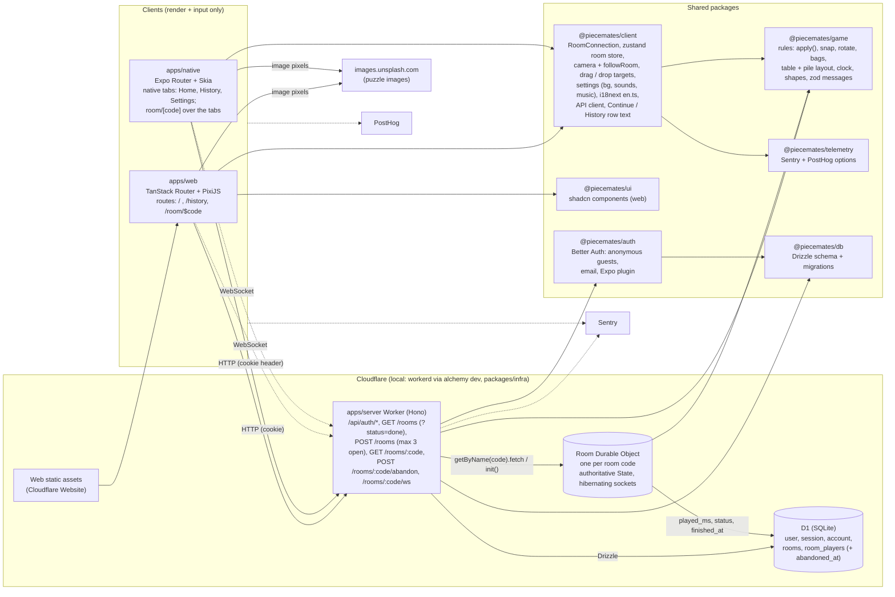
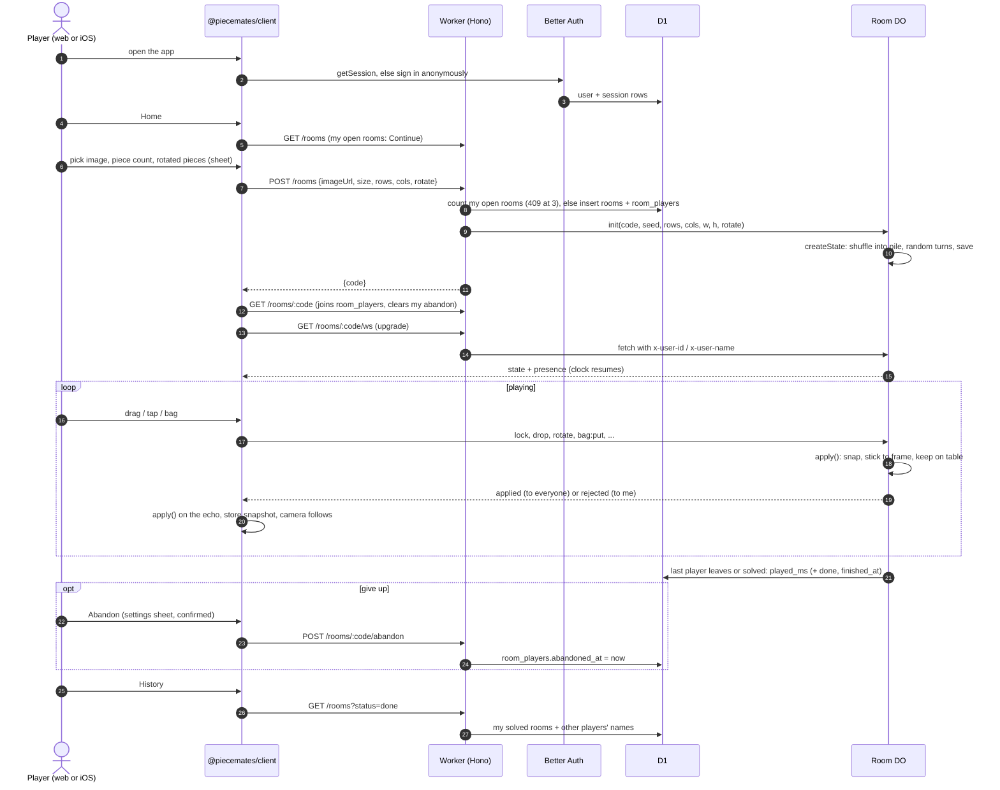

# Architecture

How Piecemates fits together, for planning and for picking the project back up. Rules for contributors are in `AGENTS.md`; plans are in `ROADMAP.md`.

## The whole project

- **Who decides:** the Room Durable Object runs `apply()` from `@piecemates/game` on every message and broadcasts what it accepted. Clients run the same `apply()` on the echo, so everyone's state stays identical. Only the dropped piece's position travels.
- **What is stored where:** live piece state lives in the Durable Object's storage (one `state` key per room). D1 only indexes rooms: who owns them, who played (and who abandoned), the seed and grid, play time and whether it's solved (for Continue and History).
- **The server never touches pixels:** piece shapes come from `(seed, rows, cols)`, so every client cuts the same puzzle from the image URL.
- **Per device, never sent:** the camera, which bag I'm looking at, my tidy positions, and my settings (table colour, sounds, haptics, music).

## A room's life

## Where to look

| Concern | Code |
| --- | --- |
| Game rules and their tests | `packages/game/src/*.ts`, `game.test.ts` |
| Room socket, local copy, cues | `packages/client/src/room-connection.ts` |
| What React reads | `packages/client/src/room-store.ts` |
| Camera maths and following the room | `packages/client/src/camera.ts`, `camera-follow.ts` |
| Web board | `apps/web/src/hooks/use-pixi-board.ts`, `lib/pixi/*` |
| Native board | `apps/native/components/board/*`, `hooks/use-board-gestures.ts`, `lib/camera.ts` |
| Native tabs | `apps/native/app/(tabs)/*`, `components/tab-stack.tsx` |
| HTTP API | `apps/server/src/index.ts`, `my-rooms.ts` |
| Room authority | `apps/server/src/room.ts` |
| Tables | `packages/db/src/schema/*.ts`, migrations in `packages/db/src/migrations` |
| Cloudflare resources | `packages/infra/alchemy.run.ts` |
